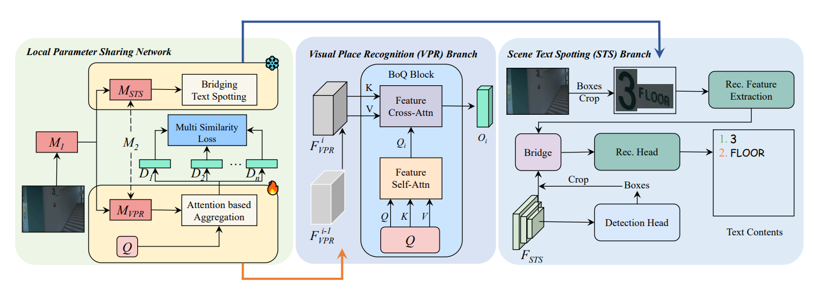

<div align="center">
<h1> TextInPlace</h1>
</div

<div align="center">
<h6>🌟 If this work is useful to you, please give this repository a Star! 🌟</h6>
</div>

<p align="center">
  <a href="#News">News</a> |
  <a href="#Usage">Usage</a> |
  <a href="#Citation">Citation</a> |
  <a href="#Acknowledgement">Acknowledgement</a>
</p >

This is the official repository for the paper:
> [**TextInPlace: Indoor Visual Place Recognition in Repetitive Structures with Scene Text Spotting and Verification**](https://arxiv.org/abs/2503.06501)

<details>
  <summary>Abstract</summary>
Visual Place Recognition (VPR) is a crucial capability for long-term autonomous robots, enabling them to identify previously visited locations using visual information. 
However, existing methods remain limited in indoor settings due to the highly repetitive structures inherent in such environments. 
We observe that scene text typically appears in indoor spaces, serving to distinguish visually similar but different places. 
This inspires us to propose TextInPlace, a simple yet effective VPR framework that integrates Scene Text Spotting (STS) to mitigate visual perceptual ambiguity in repetitive indoor environments. 
Specifically, TextInPlace adopts a dual-branch architecture within a local parameter sharing network. The VPR branch employs attention-based aggregation to extract global descriptors for coarse-grained retrieval, while the STS branch utilizes a bridging text spotter to detect and recognize scene text. 
Finally, the discriminative text is filtered to compute text similarity and re-rank the top-K retrieved images. 
To bridge the gap between current text-based repetitive indoor scene datasets and the typical scenarios encountered in robot navigation, we establish an indoor VPR benchmark dataset, called Maze-with-Text. 
Extensive experiments on both custom and public datasets demonstrate that TextInPlace achieves superior performance over existing methods that rely solely on appearance information.
</details>



## News

- **2025-06-23**: The code for TextInPlace is publicly available in this repository📦!

- **2025-06-16**: TextInPlace is accepted by IROS 2025. 🎉🎉🎉

## Usage

#### Environment Setup

You can create your own conda environment for TextInPlace based on the following command⚙️:

```bash
conda create -n stloc python=3.10 -y
conda activate stloc
pip install torch==2.2.0+cu121 torchvision==0.17.0+cu121 --index-url https://download.pytorch.org/whl/cu121
cd detectron2
pip install -e . && cd ..
pip install -r requirements.txt
python setup.py build develop
```

#### Maze-with-Text Dataset

To bridge the gap between current text-based repetitive indoor scene datasets and the typical scenarios encountered in robot navigation, we establish an indoor VPR benchmark dataset, called Maze-with-Text. First, we use a handheld Insta360 One X3 spherical camera to record videos with a resolution of 3840 × 1920 across five floors. On each floor, two videos are captured along approximately the same trajectory at different times, serving as the query and database sets, respectively. The number of images in the Maze-with-Text dataset is as follows：

| **Floor** | 1 | 2 | 3 | 4 | 5 | All |
|:----------------:|:-:|:-:|:-:|:-:|:--:|:--:|
| **Queries**   | 280 | 253 | 258 | 245 | 269 | 1305 |
| **Database**  | 1368 | 2268 | 1588 | 1720 | 1596 | 8540 |

You can download Maze-with-Text dataset from [Google Drive](https://drive.google.com/file/d/1RtW7x9VLyzHIzaMACI2YtP4KVpXkwf1r/view?usp=sharing). 
After downloading, please unzip the archive and organize the dataset into the following directory structure:

```
|-- Maze-with-Text
  |-- images
      |-- test
          |-- database
          |   |-- @-00.0027@038.6324@5@339@0@.jpg
              ......
          |-- queries
          |   |-- @-00.0012@032.7272@5@65@3@.jpg
              ......
```

#### Evaluation

Evaluation script

```shell
python -W ignore eval.py --backbone ResNet50 --aggregation boq \
  --features_dim 16384 \
  --infer_batch_size 64 \
  --config-file configs/Bridge/TotalText/R_50_poly.yaml \
  --dataset_name Maze-with-Text \
  --datasets_folder <Path with all datasets> \
  --resume <Path with the checkpoint>
```

Before running the evaluation script, please follow the steps below to validate the results of our experiments on the Maze-with-Text dataset.

- **Download Checkpoint**: Get the [checkpoint](https://drive.google.com/file/d/1fJaaLta9mJfOwALjMg63c8oXNpm3Y_Q0/view?usp=drive_link) file.

- **File Placement**: Move the downloaded checkpoint file to the designated path: `./checkpoints/`.

(Optional) If you want to use an LLM for text-based reranking, please set your own API key in `utils/test.py` and add `--use-llm` flag at the end of the command.

#### Training

> [!NOTE] 
> 
> Training code will come soon, please stay tuned.

## Citation

If you find TextInPlace helpful for your research, please consider citing:

```
@inproceedings{tao2025textinplace,
  title={TextInPlace: Indoor Visual Place Recognition in Repetitive Structures with Scene Text Spotting and Verification},
  author={Tao, Huaqi and Liu, Bingxi and Chen, Calvin and Huang, Tingjun and Li, He and Cui, Jinqiang and Zhang, Hong},
  booktitle={2025 IEEE/RSJ International Conference on Intelligent Robots and Systems (IROS)},
  year={2025},
  organization={IEEE}
}
```

## Acknowledgement

- Thanks to these great repositories: [Bag-of-Queries](https://github.com/amaralibey/Bag-of-Queries), [SuperPlace](https://github.com/BinuxLiu/SuperPlace), [NYC-Indoor-VPR](https://github.com/ai4ce/NYC-Indoor-VPR), [Bridging-Text-Spotting](https://github.com/mxin262/Bridging-Text-Spotting), [DPText-DETR](https://github.com/ymy-k/DPText-DETR/tree/main), [DiG](https://github.com/ayumiymk/DiG) and many other inspiring works in the community.

- Contact: `taohq2024@mail.sustech.edu.cn`.